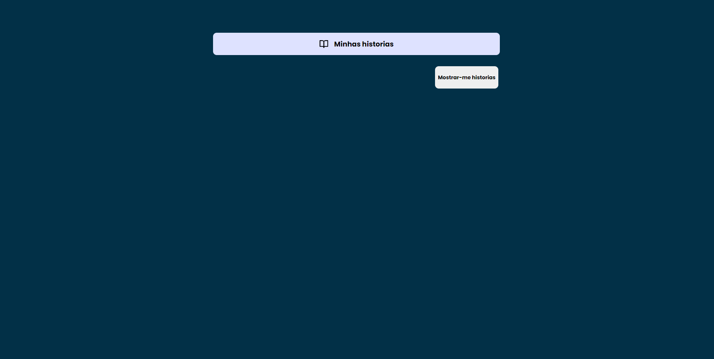
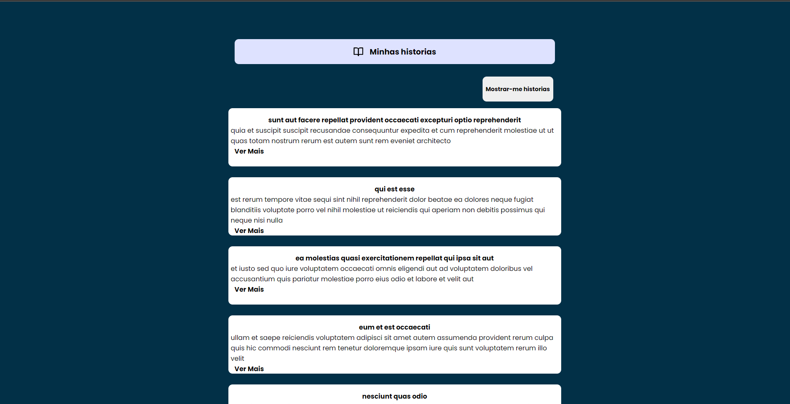
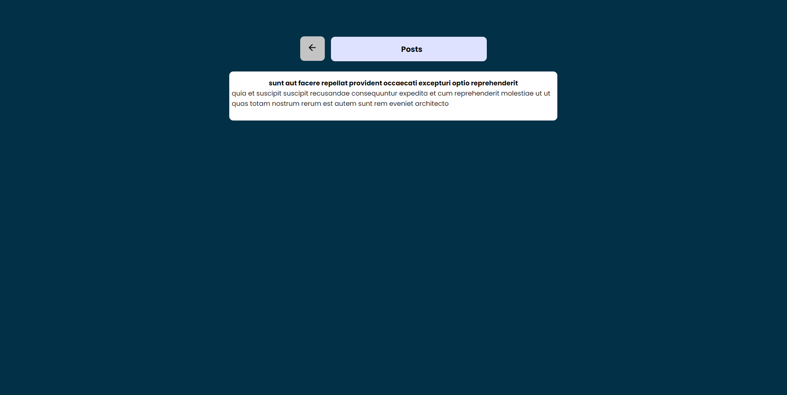
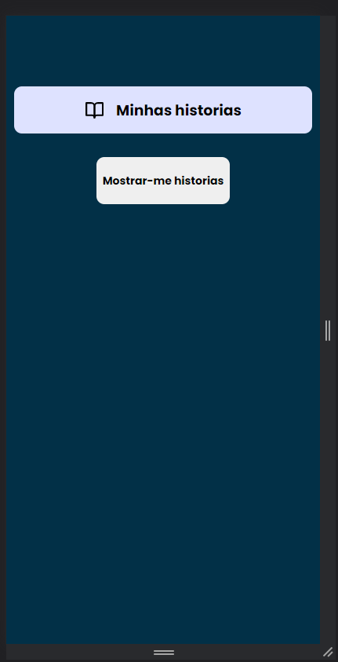
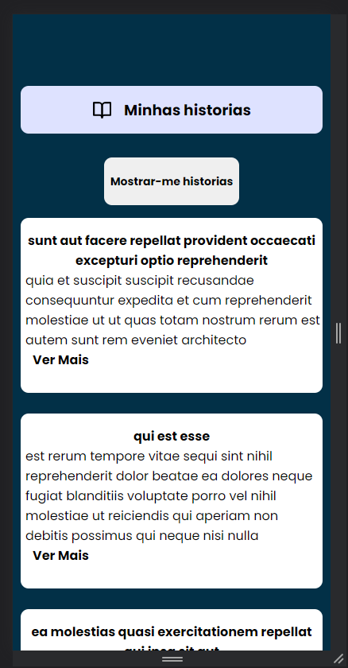
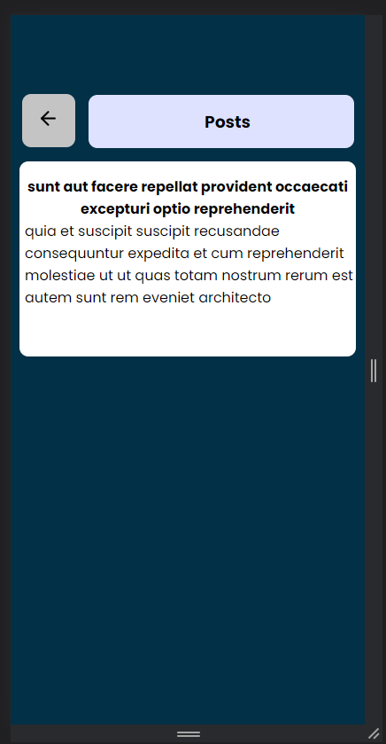

  <h1 align="center">Posts Viewing</h1>

<!-- Getting Started -->

## INICIANDO O PROJETO

Para instalar o projeto em sua maquina siga os passos abaixo.

### INSTALAÇÃO

1. Clone o repositório

   ```sh
   git clone https://github.com/NiloMarcos/PostViewing.git
   ```

2. Entre na pasta

   ```sh
   cd PostViewing
   ```

3. Instale as dependências

   ```sh
   yarn
   ```

   ou

   ```sh
   npm i

3. Caso precise installar as libs, utilizadas separada.

   ```sh
   yarn add axios, yarn add react-icons, yarn add styled-components, yarn add react-router-dom, 
   ```

### Fotos da aplicação

<div align="center">
   
   
   
</div>

<div align="center">
   
   
   
</div> <br/><br/>

1. Descreva possíveis otimizações de performance que você poderia fazer no seu
   próprio código.

R: Muitas, mas a primeira delas seria com certeza usar ContextApi, para transferir as funções utilizadas de forma global, podendo deixar <br/>
o codigo mais limpo e bem estruturado, e usando onde necessario. Codigo ficaria muito melhor em perfomace e limpo.

2. O que você poderia ter melhorado?

R: Ainda tenho muito oque melhorar no meu desenvolvimento, mas vendo agora certeza que seria algumas tags a serem melhoradas<br/>
components que poderiam ser melhores usados, e mais algumas coisas, mas tenho muito a evoluir ainda, mas sei que estou no caminho certo, e vou fazer acontecer.
